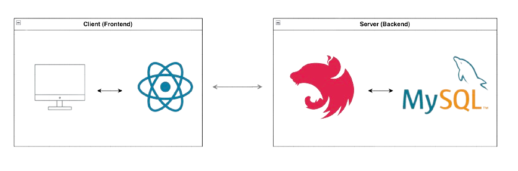
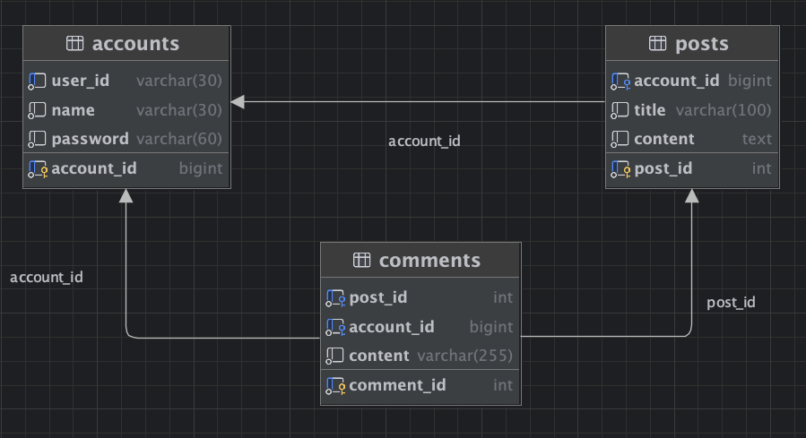
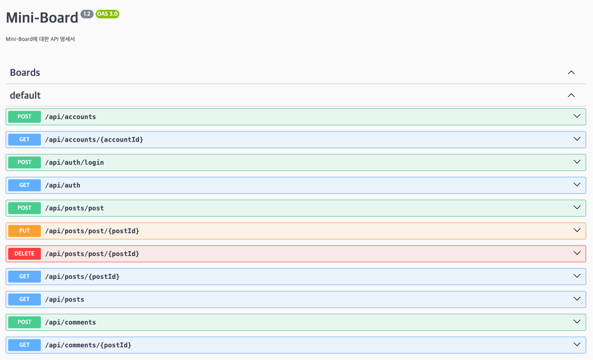
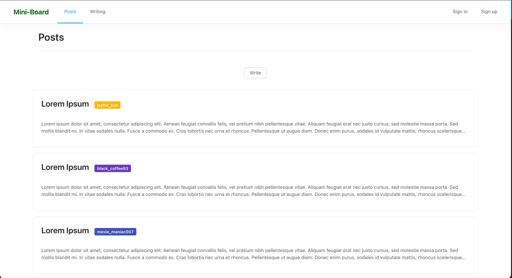
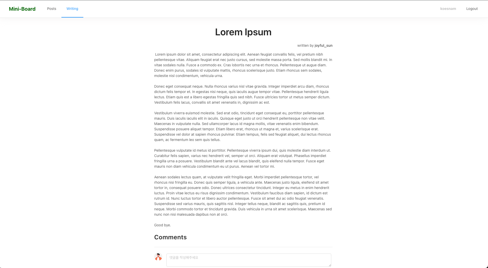
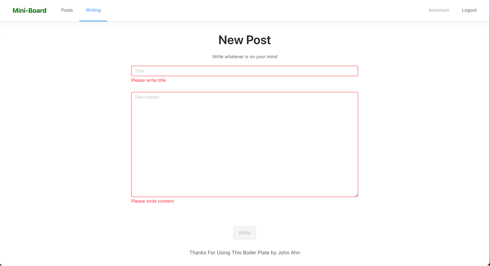
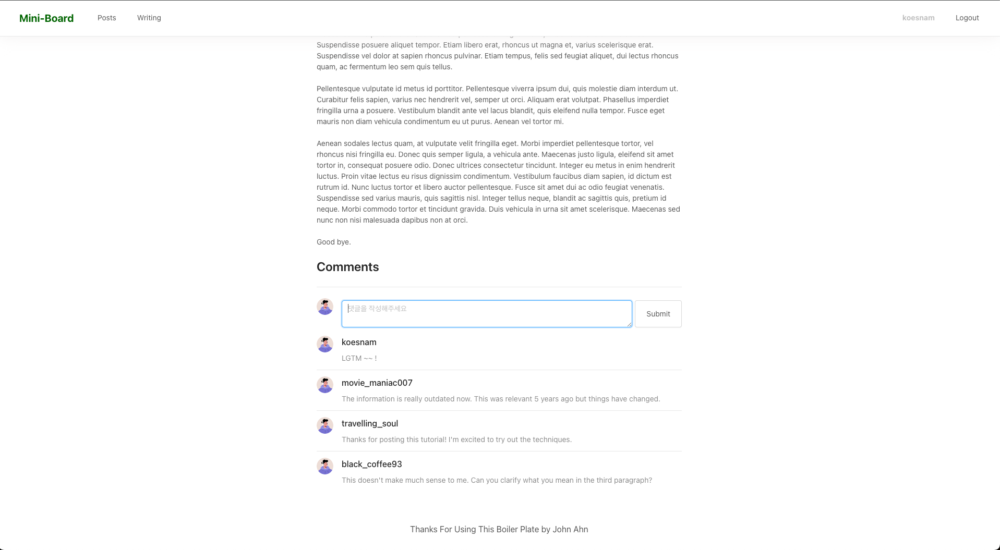
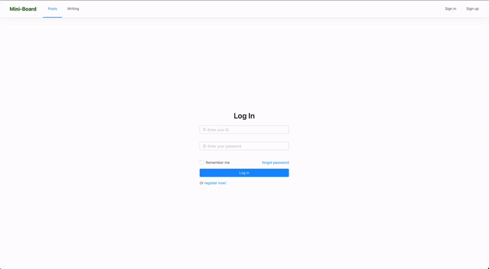

# Mini Board
React와 Nest로 구성된 간단한 게시판 프로젝트

## 요구사항 
- [x] 회원가입/로그인 (JWT 인증)
- [x] 게시물 작성
- [x] 게시물 목록보기
- [x] 게시물 읽기
- [x] 댓글 작성  

++++++++++++++++++++++++
- [x] 게시물 삭제
- [x] 게시물 수정

## 구성
- Frontend : React.js
- Backend : Nest.js, MySQL  

## Backend
### ERD 

### API SPEC

## Frontend
### 게시물 목록

### 게시물 조회

### 게시물 작성

### 댓글 작성

### 동작 화면

## 회고
React를 이용한 CSR(Client Side Rendering)을 경험했다. 이전에 경험했던 SSR에서는 매 순간 서버에 요청을 보냈지만, CSR에서는 필요한 특정 데이터만 요청하여 렌더링이 진행됐다.

SPA 프레임워크에 대한 감이 생겼다. 바닐라 스크립트로 UI를 작성했던 경험으로 인해, React 또한 어떠한 정적 파일일 것이라 생각했다. 그러나 JSX로 작성된 React를 JS로 트랜스파일링한다는 것을 알게 되어, 프론트에서도 이런 로직을 처리하는 서버(Node.js)가 필요함을 알게 됐다.

페이지별로 여러 상태를 가지며, 이러한 상태를 관리하기 위해 Redux를 사용했다. SSR로 인증을 구현해야 했을 때, 인증 정보를 어떻게 하면 클라이언트에게 덜 노출할지를 고민했었다. 클라이언트에서 이러한 상태 관리 도구나 SPA 프레임워크의 도움을 받아 클라이언트에게 노출하지 않고, 브라우저 메모리에 저장할 수 있음을 깨달았다.

Node.js가 자바스크립트 런타임이란 것을 이해했다. JS는 브라우저에서만 동작하는 언어인줄로만 알았으나, Node.js가 브라우저 외 환경에서도 동작하게 해준다는 것을 알게 됐다.

Nest에서도 서버를 구성할 때, Spring과 동일하게 컨트롤러, 서비스, 레포지토리로 계층화를 시켰다. Spring Boot에는 SpringBootApplication가 있었다면, Nest에는 main.ts의 bootstrap을 통해 서버를 실행시켰다.

TypeORM을 통해 엔터티 간 관계를 정해줬다. 게시글 개체에서 관계를 맺어둔 사용자 개체를 참조하는 과정에서 의도한 조인이 일어나지 않았다. TypeORM에서는 이를 lazy든 eager든 엔터티 안에 명시적으로 정의해 줘야 참조할 수 있었다.

페이지 이동 시 갖고 있던 상태가 모두 날아갔다. 버튼으로 페이지를 이동했을 때 유저 정보가 계속 날아가서 재인증이 필요했다. 페이지를 이동할 때, a 태그를 사용했는데, a 태그는 해당 URL을 서버로 새로 요청하게 한다. Redux는 새로고침이나 URL 이동 시 상태를 초기화시키는데, 이에 따라 상태가 모두 날아갔던 것이다. 상태를 유지하면서 페이지를 이동시키기 위해, a 태그를 react-router-dom의 Link 컴포넌트로 대체했고, URL 이동이 필요한 로직에서는 useNavigate를 활용했다.

쿼리 조회 시 DTO 필드 기준으로 매핑되지 않았다. DTO 필드에는 Camel Case로 정의되어 있으나, 실제 응답은 snake_case로 응답하였다. 해당 로직은 query builder를 통해서 DB에서 데이터를 조회했었다. 칼럼 명이 그대로 매핑되어 응답하였다. 쿼리문에 Camel Case로 alias를 추가하여 DTO에 제대로 매핑되게 했다. TypeORM에 제공하는 Repository를 사용할 때는 따로 Snake Case 설정을 해준 게 적용됐지만, query builder를 사용할 때는 설정이 적용되지 않았다.

Nest를 통해 자동으로 Typescript를 사용하게 되면서, React 사용 시에도 동일하게 사용하고 있는 줄 알았다. 어느 시점부터 뭔가 자동으로 import가 안 되거나, type에 대한 제약이 없었다. 뒤늦게 깨닫고 Typescript를 적용하려 했으나, 테스트 코드도 마땅히 없는 상황에서 적용하는 것이 맞느냐는 의문이 들었고, 차라리 그 시간에 다른 기능을 구현하는 게 낫다고 판단해서 사용하진 못했으나 다음엔 Typescript까지 적용해서 개발해 보고 싶다.